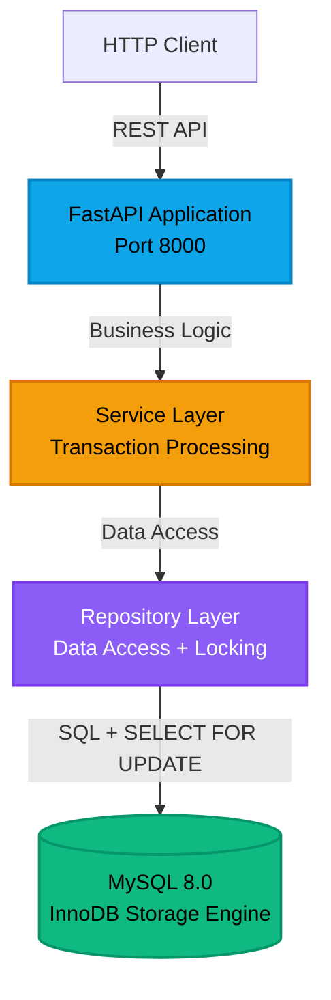
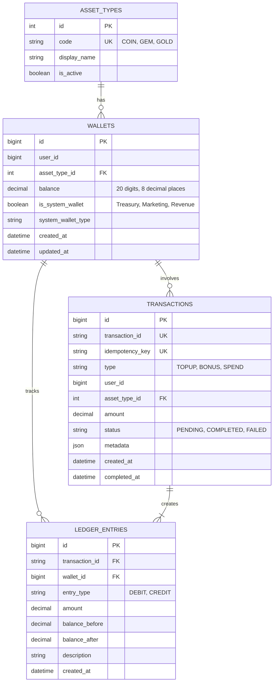

# Wallet Service

A production-ready internal wallet system for managing virtual currencies in high-traffic applications. Built to handle concurrent transactions with strong consistency guarantees, this service maintains accurate balance tracking and complete audit trails through double-entry bookkeeping.

## Overview

This service provides a closed-loop virtual currency system for applications such as gaming platforms or loyalty reward programs. It tracks user balances of application-specific credits (e.g., "Gold Coins", "Gems") and ensures data integrity under high concurrency. Every transaction is recorded with full audit trails, balances can never go negative, and the system prevents race conditions through pessimistic locking.

The system handles three core transaction types:
- **TOPUP**: User purchases credits (Treasury → User)
- **BONUS**: System grants promotional credits (Marketing → User)  
- **SPEND**: User spends credits on services (User → Revenue)

**Built with**: FastAPI, MySQL 8.0 (InnoDB), SQLAlchemy, Docker

## Architecture


### System Architecture



### Transaction Flow

```
┌────────┐         ┌─────────┐         ┌─────────┐         ┌──────────┐
│ Client │         │   API   │         │ Service │         │ Database │
└───┬────┘         └────┬────┘         └────┬────┘         └────┬─────┘
    │                   │                   │                   │
    │ POST /spend       │                   │                   │
    ├──────────────────>│                   │                   │
    │                   │ process_spend()   │                   │
    │                   ├──────────────────>│                   │
    │                   │                   │                   │
    │                   │                   │ Check idempotency │
    │                   │                   ├──────────────────>│
    │                   │                   │                   │
    │                   │                   │  Already exists?  │
    │                   │                   │<──────────────────┤
    │                   │                   │      (YES)        │
    │                   │                   │  Return cached    │
    │                   │                   │<──────────────────┤
    │                   │                   │                   │
    │                   │                   │      (NO)         │
    │                   │                   │ BEGIN TRANSACTION │
    │                   │                   ├──────────────────>│
    │                   │                   │                   │
    │                   │                   │ SELECT FOR UPDATE │
    │                   │                   │  (Lock wallets)   │
    │                   │                   ├──────────────────>│
    │                   │                   │  Locks acquired   │
    │                   │                   │<──────────────────┤
    │                   │                   │                   │
    │                   │                   │ Validate balance  │
    │                   │                   │─┐                 │
    │                   │                   │ │ Check funds     │
    │                   │                   │<┘                 │
    │                   │                   │                   │
    │                   │                   │ UPDATE balances   │
    │                   │                   ├──────────────────>│
    │                   │                   │                   │
    │                   │                   │ INSERT ledger     │
    │                   │                   ├──────────────────>│
    │                   │                   │                   │
    │                   │                   │ UPDATE status     │
    │                   │                   ├──────────────────>│
    │                   │                   │                   │
    │                   │                   │ COMMIT            │
    │                   │                   ├──────────────────>│
    │                   │                   │ (Release locks)   │
    │                   │                   │<──────────────────┤
    │                   │                   │                   │
    │                   │ Transaction       │                   │
    │                   │<──────────────────┤                   │
    │                   │                   │                   │
    │  200 OK           │                   │                   │
    │<──────────────────┤                   │                   │
    │  {result}         │                   │                   │
    │                   │                   │                   │
```

### Database Schema



## Quick Start

### Prerequisites

- Docker and Docker Compose
- Port 3306 (MySQL) and 8000 (API) available

### Setup and Run

```bash
# Clone the repository
git clone https://github.com/tievenr/Wallet-Service.git
cd Wallet-Service

# Copy environment configuration
cp .env.example .env

# Start services (MySQL + API)
./scripts/startup.sh
```

The API will be available at:
- **API**: http://localhost:8000
- **API Docs**: http://localhost:8000/docs (Swagger UI)
- **Health Check**: http://localhost:8000/health

### Verify Installation

```bash
# Check health endpoint
curl http://localhost:8000/health

# Expected response:
# {"status":"healthy"}
```

## API Examples

### 1. TOPUP Transaction (User Purchases Credits)

```bash
curl -X POST http://localhost:8000/api/v1/transactions/topup \
  -H "Content-Type: application/json" \
  -d '{
    "idempotency_key": "topup-user1-001",
    "user_id": 1,
    "asset_type": "COIN",
    "amount": 100.00,
    "metadata": {"payment_id": "pay_123"}
  }'
```

**Response:**
```json
{
  "transaction_id": "a1b2c3d4-e5f6-7890-abcd-ef1234567890",
  "idempotency_key": "topup-user1-001",
  "transaction_type": "TOPUP",
  "user_id": 1,
  "asset_type_id": 1,
  "amount": "100.00000000",
  "status": "COMPLETED",
  "created_at": "2026-02-07T10:30:00",
  "completed_at": "2026-02-07T10:30:00"
}
```

### 2. BONUS Transaction (Marketing Grants Credits)

```bash
curl -X POST http://localhost:8000/api/v1/transactions/bonus \
  -H "Content-Type: application/json" \
  -d '{
    "idempotency_key": "bonus-user1-referral",
    "user_id": 1,
    "asset_type": "COIN",
    "amount": 50.00,
    "metadata": {"reason": "referral_bonus"}
  }'
```

### 3. SPEND Transaction (User Spends Credits)

```bash
curl -X POST http://localhost:8000/api/v1/transactions/spend \
  -H "Content-Type: application/json" \
  -d '{
    "idempotency_key": "spend-user1-item-001",
    "user_id": 1,
    "asset_type": "COIN",
    "amount": 25.00,
    "metadata": {"item_id": "sword_001"}
  }'
```

**Insufficient Funds Response (400):**
```json
{
  "detail": "User wallet has insufficient funds. Balance: 10.00, Required: 25.00"
}
```

### 4. Check Wallet Balance

```bash
curl "http://localhost:8000/api/v1/wallets/1/balance?asset_type_id=1"
```

**Response:**
```json
{
  "user_id": 1,
  "asset_type_id": 1,
  "asset_type_code": "COIN",
  "balance": "125.00000000"
}
```

### 5. Idempotency (Duplicate Request)

```bash
# Send the same request twice with the same idempotency_key
curl -X POST http://localhost:8000/api/v1/transactions/topup \
  -H "Content-Type: application/json" \
  -d '{
    "idempotency_key": "topup-user1-001",
    "user_id": 1,
    "asset_type": "COIN",
    "amount": 100.00
  }'

# Second request returns the SAME transaction_id (no duplicate processing)
```

## System Wallets

The service uses three system wallets per asset type for internal accounting:

| Wallet | User ID | Purpose |
|--------|---------|---------|
| **TREASURY** | -1 | Source of funds for TOPUP transactions |
| **MARKETING** | -2 | Source of funds for BONUS transactions |
| **REVENUE** | -3 | Destination for SPEND transactions |

Each system wallet is seeded with 1,000,000 units per asset type (except REVENUE which starts at 0).

## Core Design Decisions

### 1. Double-Entry Ledger System

Every transaction creates two ledger entries with opposite signs, ensuring the sum of all entries equals zero. This provides:

- **Complete Audit Trail**: Every balance change is recorded with before/after snapshots
- **Data Integrity**: The system is self-verifying (sum of entries = 0)
- **Forensic Analysis**: Trace any balance discrepancy to its source transaction

**Example**: User spends 50 COIN
```
Ledger Entry 1 (User Wallet):
  - Type: DEBIT
  - Amount: -50.00
  - Balance: 100.00 → 50.00

Ledger Entry 2 (Revenue Wallet):
  - Type: CREDIT
  - Amount: +50.00
  - Balance: 0.00 → 50.00

Sum: -50 + 50 = 0 ✓
```

### 2. Concurrency Control (Pessimistic Locking)

The service uses database row-level locks (`SELECT ... FOR UPDATE`) to prevent race conditions:

```python
# Lock wallets before any balance operations
user_wallet = wallet_repo.get_wallet_with_lock(db, user_id, asset_type_id)
revenue_wallet = wallet_repo.get_wallet_with_lock(db, SYSTEM_USER_IDS["REVENUE"], asset_type_id)

# Locks are held until transaction commits
# Other threads attempting to lock the same wallets will WAIT
```

**Why Pessimistic Locking?**
- **Strong Consistency**: Impossible for two threads to simultaneously modify the same wallet
- **Automatic Serialization**: Database handles contention, no application-level retry logic needed
- **Low Latency**: Transactions complete in < 40ms even under load

**Critical Fix**: The initial implementation had a bug where `update_wallet_balance()` performed a new query instead of modifying the locked wallet object, effectively bypassing the lock. This was fixed by passing the locked wallet object directly.

### 3. Idempotency

Every transaction requires a unique `idempotency_key`. If a duplicate request arrives:

```python
# Check if already processed
existing = transaction_repo.get_by_idempotency_key(db, request.idempotency_key)
if existing:
    return existing  # Return cached result, no reprocessing
```

**Use Cases**:
- Network retries don't duplicate charges
- Client-side "double-click" protection
- Webhook replay safety

**Implementation**: Unique index on `transactions.idempotency_key` enforces database-level uniqueness.

### 4. Deadlock Avoidance

When a transaction requires multiple wallet locks, they are **always acquired in ascending wallet ID order**:

```python
# Correct: Always lock lower ID first
if user_wallet.id < revenue_wallet.id:
    lock(user_wallet)
    lock(revenue_wallet)
else:
    lock(revenue_wallet)
    lock(user_wallet)
```

**Why This Works**:
- Thread A locks wallet 100 then wallet 200
- Thread B locks wallet 100 then wallet 200 (same order)
- Result: Thread B waits for Thread A to release wallet 100, never creating a circular dependency

**System Wallet Design**: System wallets (Treasury=-1, Marketing=-2, Revenue=-3) use negative user_ids, ensuring they always sort before positive user IDs. This creates a natural lock ordering: system wallets → user wallets.

## Testing

Comprehensive testing documentation including unit tests, integration tests, concurrency tests, and load testing is available in [TESTING.md](TESTING.md).

**Quick start:**
```bash
# Run all 69 tests
pytest tests/ -v

# Run specific test categories
pytest tests/test_concurrency.py -v
```

## Project Structure

```
wallet-service/
├── app/
│   ├── main.py                 # FastAPI application entry point
│   ├── config.py               # Environment configuration
│   ├── database.py             # SQLAlchemy engine and session
│   │
│   ├── api/
│   │   └── v1/
│   │       ├── __init__.py     # API router aggregation
│   │       ├── health.py       # Health check endpoint
│   │       ├── wallets.py      # Balance endpoints
│   │       └── transactions.py # TOPUP, BONUS, SPEND endpoints
│   │
│   ├── models/
│   │   ├── asset_types.py      # Asset type model (COIN, GEM, GOLD)
│   │   ├── wallet.py           # Wallet model with balance
│   │   ├── transaction.py      # Transaction model with idempotency
│   │   └── ledger.py           # Ledger entry model (double-entry)
│   │
│   ├── repositories/
│   │   ├── wallet_repository.py      # Wallet CRUD + locking
│   │   ├── transaction_repository.py # Transaction CRUD + idempotency
│   │   └── ledger_repository.py      # Ledger entry creation
│   │
│   ├── services/
│   │   ├── transaction_service.py    # Core business logic (TOPUP, BONUS, SPEND)
│   │   └── wallet_service.py         # Wallet utilities
│   │
│   ├── schemas/
│   │   ├── transaction.py      # Pydantic request/response models
│   │   └── wallet.py           # Wallet response models
│   │
│   ├── utils/
│   │   ├── constants.py        # System wallet IDs, transaction types
│   │   └── exceptions.py       # Custom exceptions
│   │
│   └── middleware/
│       └── error_handler.py    # Global exception handlers
│
├── migrations/
│   ├── env.py                  # Alembic configuration
│   └── versions/
│       └── 97548888b022_initial_schema.py  # Database schema
│
├── tests/
│   ├── conftest.py             # Pytest fixtures (db_session, client)
│   ├── test_wallet_repo.py     # Wallet repository tests
│   ├── test_transaction_repo.py # Transaction repository tests
│   ├── test_ledger_repo.py     # Ledger repository tests
│   ├── test_transaction_service.py  # Service layer tests (24 tests)
│   ├── test_transaction_api.py # API integration tests (21 tests)
│   └── test_concurrency.py     # Concurrency and race condition tests
│
├── scripts/
│   └── seed.sql                # Initial data (asset types, system wallets)
│   └── startup.sh              # Quickstart Script
|
├── docker-compose.yml          # MySQL + App containers
├── Dockerfile                  # Python 3.11 with dependencies
├── requirements.txt            # Python packages
├── alembic.ini                 # Database migration config
├── locustfile.py               # Load testing scenarios
└── .env.example                # Environment variables template
```

## API Documentation

Interactive API documentation is automatically generated by FastAPI:

- **Swagger UI**: http://localhost:8000/docs
- **ReDoc**: http://localhost:8000/redoc
